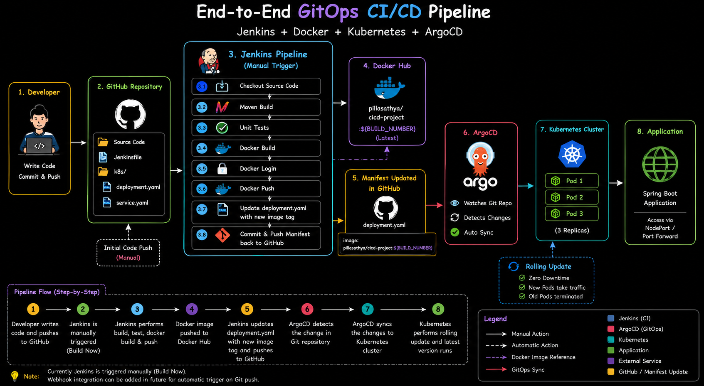
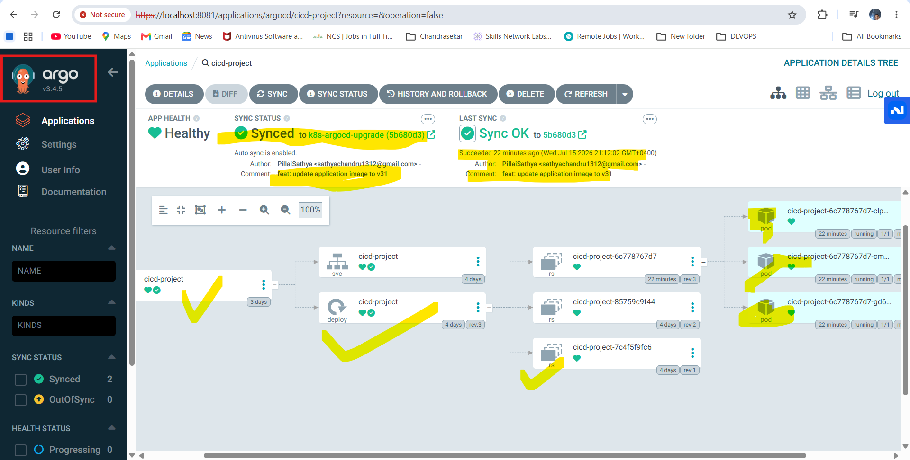
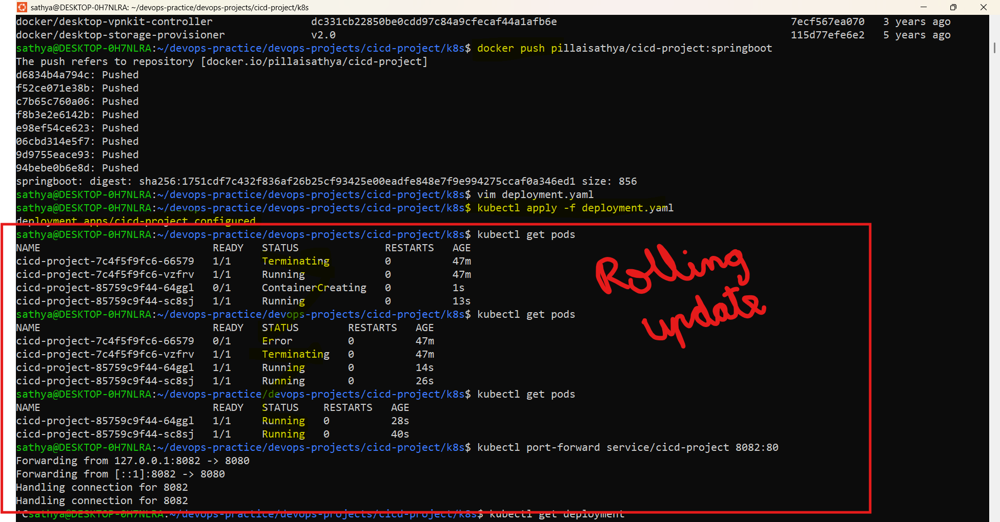
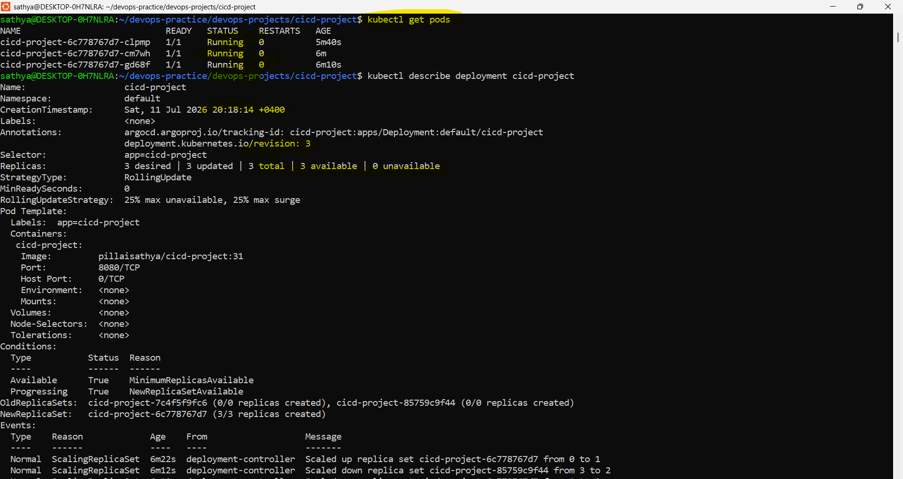

# 🚀 End-to-End GitOps CI/CD Pipeline using Jenkins, Docker, Kubernetes & ArgoCD

## 📖 Project Overview

This project demonstrates an end-to-end GitOps based CI/CD pipeline for deploying a Spring Boot application using Jenkins, Docker, Kubernetes, and ArgoCD.

The pipeline automates the software delivery process from source code build to Kubernetes deployment while following GitOps principles.

Unlike a traditional deployment pipeline, Jenkins updates the Kubernetes deployment manifest with the latest Docker image tag, commits the change back to GitHub, and ArgoCD automatically synchronizes the Kubernetes cluster.

---

# 🏗 Architecture




```
                Developer
                    │
         Git Commit & Push
                    │
                    ▼
          GitHub Repository
                    │
          (Manual Build Trigger)
                    │
                    ▼
             Jenkins Pipeline
                    │
    ┌───────────────┼──────────────────────┐
    ▼               ▼                      ▼
Checkout        Maven Build           Maven Test
                    │
                    ▼
             Docker Build
                    │
                    ▼
            Push to Docker Hub
                    │
                    ▼
      Update deployment.yaml
                    │
                    ▼
      Commit Manifest to GitHub
                    │
                    ▼
             ArgoCD watches Git
                    │
                    ▼
      Kubernetes Rolling Update
                    │
                    ▼
     Spring Boot Application
```

---

# 🚀 Features

- Complete CI/CD pipeline using Jenkins
- Spring Boot application build using Maven
- Unit testing using Maven
- Docker image creation
- Docker Hub image publishing
- Kubernetes Deployment & Service manifests
- GitOps workflow using ArgoCD
- Automatic Kubernetes manifest update
- Automatic manifest commit to GitHub
- Rolling updates using Kubernetes Deployments
- Three application replicas running inside Kubernetes
- Image versioning using Jenkins BUILD_NUMBER

---

# 🛠 Tech Stack

| Category | Technologies |
|----------|--------------|
| Language | Java |
| Framework | Spring Boot |
| Build Tool | Maven |
| CI | Jenkins |
| Container | Docker |
| Registry | Docker Hub |
| Orchestration | Kubernetes |
| GitOps | ArgoCD |
| Version Control | Git & GitHub |
| OS | Ubuntu WSL |

---

# 📂 Project Structure

```text
.
├── Dockerfile
├── Jenkinsfile
├── README.md
├── ansible/
├── k8s/
│   ├── deployment.yaml
│   └── service.yaml
├── screenshots/
│   ├── cicd_main/
│   └── K8s/
├── src/
└── pom.xml
```

---

# ⚙️ Prerequisites

- Java 17
- Maven
- Docker
- Kubernetes Cluster
- Jenkins
- Git
- GitHub
- Docker Hub Account
- ArgoCD

---

# 🔄 CI/CD Workflow

### Step 1

Developer commits code to GitHub.

### Step 2

Jenkins Pipeline is manually triggered using **Build Now**.

### Step 3

Jenkins checks out the latest source code.

### Step 4

Maven builds the Spring Boot application.

### Step 5

Unit tests are executed.

### Step 6

Docker image is created.

### Step 7

Docker image is pushed to Docker Hub.

### Step 8

Jenkins updates the image tag inside:

```
k8s/deployment.yaml
```

### Step 9

Updated Kubernetes manifest is committed and pushed back to GitHub.

### Step 10

ArgoCD detects the Git change.

### Step 11

ArgoCD synchronizes the Kubernetes cluster.



### Step 12

Kubernetes performs a Rolling Update.



### Step 13

Latest version of the Spring Boot application becomes available.



---

# ☸️ Kubernetes Deployment

Deployment includes:

- 3 Spring Boot replicas
- Rolling Updates
- Self-healing
- Declarative configuration
- Image version updates through GitOps

---

# 🔁 GitOps Workflow

Instead of deploying directly to Kubernetes, Jenkins updates the Kubernetes manifest stored in Git.

ArgoCD continuously watches the Git repository.

Whenever the deployment manifest changes, ArgoCD automatically synchronizes the Kubernetes cluster to match the desired state stored in Git.

This follows the GitOps deployment model.

Jenkins never deploys directly to Kubernetes. Instead, Git becomes the single source of truth, and ArgoCD continuously reconciles the cluster with the desired state stored in Git.

This sounds very professional and shows you understand GitOps, not just the commands.
---

# 📸 Project Screenshots

## Jenkins Pipeline

- Maven Build
- Successful Pipeline
- Docker Image Build

## Docker Hub

- Docker Image Push

## Kubernetes

- Deployment
- Service
- Rolling Update
- Running Pods

## ArgoCD

- Application Synchronization
- Automatic Deployment

---

# ⚠️ Challenges Faced

During this project, several real-world issues were encountered and resolved.

- Configured Docker inside Jenkins container.
- Installed Maven inside Jenkins.
- Resolved Docker permission denied issues.
- Configured GitHub Personal Access Token.
- Automated Kubernetes manifest updates.
- Implemented GitOps workflow using ArgoCD.
- Understood and resolved SCM polling infinite build loop caused by Jenkins committing back to the same repository.
- Verified Kubernetes rolling updates using image version changes.

---

# 📚 Key Learnings

Through this project I learned:

- Jenkins Pipeline development
- Docker image versioning
- Kubernetes Deployments and Services
- Rolling Updates
- GitOps principles
- ArgoCD synchronization
- GitHub authentication using Personal Access Tokens
- CI/CD troubleshooting
- Debugging Jenkins pipelines
- Production-style deployment workflow

---

# 🚀 Future Improvements

- GitHub Webhook integration
- Helm Charts
- Separate GitOps manifests repository
- Jenkins Shared Libraries
- Prometheus & Grafana monitoring
- Slack/Email notifications
- Kubernetes Ingress
- Production-ready Kubernetes cluster

---

## Project Highlights

- CI/CD Pipeline using Jenkins
- Spring Boot Application
- Docker Image Versioning
- Kubernetes Deployment (3 Replicas)
- GitOps with ArgoCD
- Rolling Updates
- Docker Hub Integration
- GitHub PAT Authentication
- Automated Manifest Updates

# 👨‍💻 Author

**Pillai Sathya Sudalai**

DevOps | Cloud | Linux | Kubernetes | Docker | Jenkins

GitHub:
https://github.com/PillaiSathya
